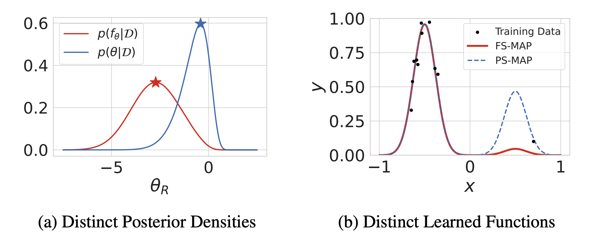

# Should We Learn Most Likely Functions or Parameters?

This repository contains the code for the paper [Should We Learn Most Likely Functions or Parameters?
](https://arxiv.org/abs/2311.15990) by Shikai Qiu, Tim G. J. Rudner, Sanyam Kapoor and Andrew Gordon Wilson (NeurIPS 2023).

<figure>
  
  <figcaption> Standard regularized training procedures correspond to learning the most likely parameters of our model given the data and our prior. However, model parameters are of interest only insomuch as they combine with the
functional form of a model to provide a function that can make good predictions.
Moreover, the most likely parameters under the parameter posterior do not generally
correspond to the most likely function induced by the parameter posterior. The aim of this paper is to improve our understanding of what it means to learn most likely functions instead of parameters. We investigate the benefits and drawbacks
of directly estimating the most likely function implied by the model and the data.
We show that this procedure leads to pathological solutions when using neural
networks, and prove conditions under which the procedure is well-behaved, as well
as a scalable approximation. Under these conditions, we find that function-space
MAP estimation can lead to flatter minima, better generalization, and improved
robustness to overfitting. On the other hand, while distinguishing between the two approaches proves valuable when we have highly motivated priors, the advantages are modest in many practical problems with uninformative priors. </figcaption>
</figure>

## Setup

Create a new conda environment (if needed):
```
conda env create -f environment.yml -n fsmap
```

The codebase has been tested with the latest PyTorch.
```shell
pip install torch torchvision --extra-index-url https://download.pytorch.org/whl/cu118/
```

Install CUDA-compiled JAX version from [here](https://github.com/google/jax#installation). The
codebase has been tested with JAX version `0.4`.
```shell
pip install "jax[cuda11_pip]" -f https://storage.googleapis.com/jax-releases/jax_cuda_releases.html
```

**NOTE**: Use `cuda11_pip` or `cuda12_pip` depending on CUDA versions.

And finally, run
```
pip install -e .
```

## Usage

### **Synthetic Experiments**
- **Gaussian Mixture Model Regression** (Sections 1 & 4.3)  
  Run `./notebooks/gaussian_mixture.ipynb`

- **Fourier Basis Regression** (Section 3.3)  
  Run `./notebooks/fourier.ipynb`

- **Visualizing Lack of Reparameterization Invariance of PS-MAP** (Appendix A)  
  Run `./notebooks/reparam.ipynb`

### **UCI Regression** (Section 4.5)  
  Run `./notebooks/uci.ipynb`

### **Image Classification** (Section 4.5)

The main file for training `PS-MAP` is [experiments/train.py](./experiments/train.py).

An example command to run the training with FashionMNIST with `PS-MAP` is
```shell
python experiments/train.py \
    --dataset=fmnist --batch-size=128 \
    --model-name=resnet18 \
     --lr=0.1 --weight-decay=5e-4 \
    --epochs=50 --seed=173 \
    --log-dir=logs
```

See below for a summary of all important arguments:
- `--dataset`: The training dataset. e.g. `fmnist` (FashionMNIST), `cifar10` (CIFAR-10), etc.
- `--ctx-dataset`: The context dataset.
- `--model-name`: We use `resnet18` (ResNet-18) for all our experiments.
- `--batch-size`: Size of the minibatch used for each gradient update.
- `--context-size`: Size of the minibatch used for each context gradient update.
- `--epochs`: Number of epochs to train for.
- `--lr`: Learning rate for SGD.
- `--weight-decay`: Weight decay for SGD.
- `--reg_scale`: Regularization scale for use with `L-MAP`. Default `0.0` corresponds to `PS-MAP`.
- `--seed`: Seed used for model initialization, and dataset sampling.


#### Transfer Learning

We use pretrained ResNet checkpoints from [Flaxmodels](https://github.com/matthias-wright/flaxmodels). 
To use them, simply specify `--model-name=resnet50_pt` or `--model-name=resnet18_pt` in conjunction with other arguments above.

Note that when using with CIFAR-10, we need to resize the images to `224 x 224` to be compatible with pretraining. We provide the resized versions via the argument `--dataset=cifar10_224`.
We specify context dataset for `L-MAP` as `--ctx-dataset=cifar100_224`.

### Evaluate

The file [experiments/evaluate.py](./experiments/evaluate.py) can be used to evaluate trained checkpoints independently.

The key arguments are:
- `--model-name`:  We use `resnet18` (ResNet-18) for all our experiments, same as above.
- `--ckpt-path`: Path to the directory where the checkpoint is stored, or the checkpoint directly. This is often the prefix of the `--log-dir` reported in the training runs.
- `--dataset`: The dataset with which the checkpoint was trained (so that the checkpoint parameters can be mapped correctly).
- `--batch-size`: Batch size used during evaluation. A larger batch size can be used since we do not need memory to preserve computational graphs.

### Evaluate Landscape

The file [experiments/evaluate_landscape.py](./experiments/evaluate_landscape.py) can be used to assess the landscape around trained checkpoints.
We use [Filter Normalization](https://arxiv.org/abs/1712.09913) to plot perturbations along random directions around the optimum.

In terms of design, the number of GPUs avaiable decides the number of random directions we evaluation in a single run (via `pmap`),
and on each GPU we take multiple steps in the random directions evaluated (via `vmap`).

A sample command to evaluate CIFAR-10 landscape is:
```shell
python experiments/evaluate_landscape.py \
    --dataset=cifar10 --model-name=resnet18 \
    --batch-size=128 --ckpt-path=${CKPT_PATH} \
    --step_lim=50. --n-steps=50 \
    --seed=137
```

The new key arguments are:
- `--step-lim`: The limit of the step size `s`, such that we take steps along the random direction as `[-s, s]`.
- `--n-steps`: The number of steps in the range `[-s,s]`.

Use `CUDA_VISIBLE_DEVICES` to control the number of GPUs available for parallel evaluation of multiple random directions.
Alternatively, use multiple runs to get more random directions with different seeds.

## LICENSE

Apache 2.0

## Citation
Please cite our work as:
```bibtex
@inproceedings{qiu2023should,
    title={{Should We Learn Most Likely Functions or Parameters?}},
    author={Shikai Qiu and Tim G. J. Rudner and Sanyam Kapoor and Andrew Gordon Wilson},
    booktitle={Advances in Neural Information Processing Systems},
    year={2023}
}
```
